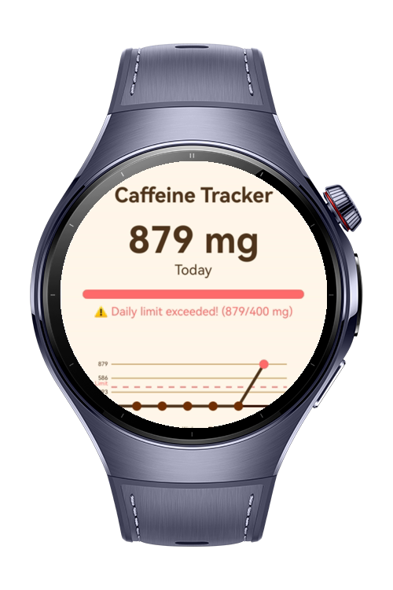
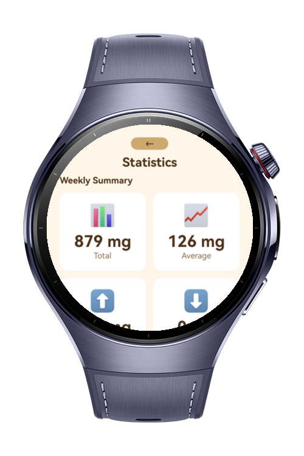
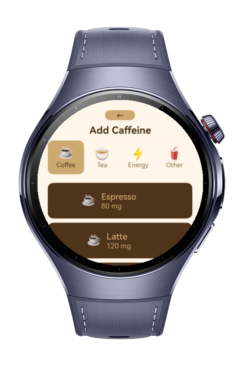
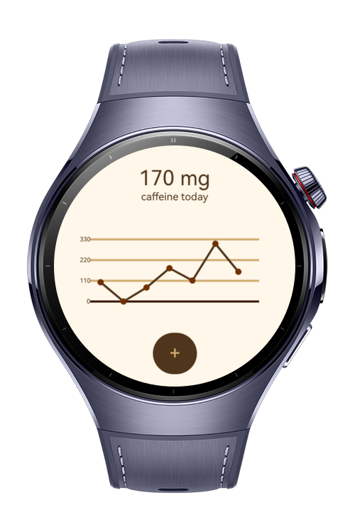

# Coffee Tracker

Coffee Tracker helps you maintain healthy caffeine habits through real-time tracking and intelligent insights. Built
with clean MVVM architecture, it tracks caffeine from coffee, tea, energy drinks, and other sources while providing
warnings based on WHO's recommended 400mg daily limit.

# Preview

<div>
    
    
    
    
</div>

# Use Cases

* 📊 Real-time daily caffeine tracking with visual progress
* ⚠️ Smart health warnings (400mg limit)
* 📈 Weekly statistics and trend analysis
* ☕ 21 pre-configured drinks across 4 categories
* ⭐ Favorites system for quick logging
* 🎯 Clean MVVM architecture for performance

# Technology

## Stack

**Languages**: ArkTS, ArkUI  
**Frameworks**: HarmonyOS SDK 5.1.0  
**Tools**: DevEco Studio 6.0.0  
**Libraries/Kits**:

- @ohos.data.preferences
- @ohos.events.emitter

# Directory Structure

```
entry/src/main/
 ├── ets
 │   ├── model/
 │   │   ├── CaffeineModels.ets
 │   ├── pages/
 │   │   ├── Index.ets
 │   │   ├── CustomCaffeine.ets 
 │   │   ├── StatisticsPage.ets
 │   │   └── AddCaffeine.ets
 │   ├── repository
 │   │   ├── CaffeineRepository.ets
 │   ├── viewmodel/
 │   │   ├── CaffeineViewModel.ets
 │   └── resources/
 │       └── module.json5
 │   
 └── resources/base/profile/route_map.json
```

# Constraints and Restrictions

## Supported Device

- Huawei Watch 5

# License

**Coffee Tracker** is distributed under the terms of the **MIT License**.  
See the [LICENSE](LICENSE) file for more information.  
